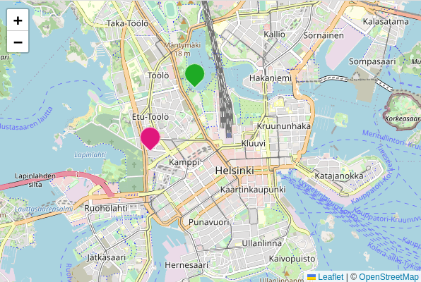

# FoE - simple Leaflet map
This is a simple example setup of a [Leaflet](https://leafletjs.com) map using OpenStreetMap tiles in a single HTML page.



The markers are defined with latitude, longitude, and a name, which is displayed in a popup when the marker is clicked. Additionally a color for the makrer can be provided.

The marker positons are defined in the beginning of the file following line 16. To extend the list simply add a new descriptions in the one of the following formats (either with a color definition or not):
```
{
    name: "Hello world!",
    lat: 60.177, 
    lon: 24.933,
    color: "#e0177c",
},

{
    name: "Hello world!",
    lat: 60.177, 
    lon: 24.933,
},
```
The color is optional and the line can be deleted. The default color is a light green.

**Important**: Each line in the curly brackets needs to end with a comma. Also place a comma after the closing curly bracket, as seen in the example.
Texts needs to be put in quotation marks, as seen for the name and color.

## Local test
Download and edit the `map.html` file on your computer with a text editor of your choice. The only changes should be in the definiton of the `points` after line 16.

To view the map just open the file in a browser (for example by double-clicking the file in the file explorer).

As help for figuring out the coordinates for lat and lon you can click anywhere on the map and a popup will tell you the coordinates at that spot which you can copy into the points definiton.

After changing and saving the `map.html` file, reload the browser window with the reload button or F5 key.
